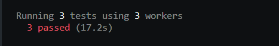

This course is 
Master Playwright V1.41 + Docker, Cucumber, Jenkins - FEB'24

Run:
1) Run 3 workers in parallel mode:
+ npx playwright test --workers 3

2) Run specific test at specific browser
+ npx playwright test --headed --project=chromium

3) Run specific test
   + npx playwright test hookTests.spec.ts --project=chromium --headed

4) Install Luxon (https://www.npmjs.com/package/luxon)
   + npm install -D luxon